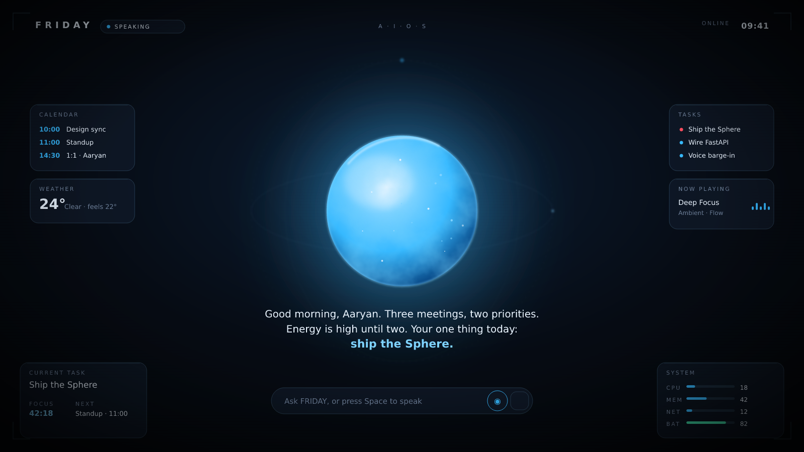

<div align="center">

# FRIDAY

### Your world. Orchestrated.

A personal desktop AI that feels like an intelligent being living inside your
machine. Voice-first. Visually cinematic. Local-first. Not a chatbot — a presence.



</div>

---

## What this is

FRIDAY is built around a single living object — **the Sphere** — whose color,
motion and glow *are* the product's emotional language. It boots cinematically,
listens on a wake word, thinks transparently, speaks back, and orchestrates your
desktop. This repo contains a **runnable cinematic core** plus the architecture
to grow it into the full JARVIS-class assistant.

Read the decisions:
[Vision](docs/VISION.md) ·
[Architecture](docs/ARCHITECTURE.md) ·
[Design System](docs/DESIGN_SYSTEM.md) ·
[Roadmap](docs/ROADMAP.md)

## What's built (Phase 0 — Cinematic Core)

- 🟦 **The Sphere** — real GLSL shaders: noise-displaced energy surface, fresnel
  glow, internal stars, thinking-storm turbulence, audio-reactive ripples, red
  alert pulse — all **11 canonical states** + 7 emotional tints, with bloom.
- 🎬 **Cinematic boot** — energy point → sphere forms → scan-lines → greeting (≤4s).
- 🧠 **Nervous system** — a typed event bus + Zustand store wiring voice, state and visuals.
- 🗣️ **Voice engine** — Web Speech STT/TTS, mic-level metering, interruptible speech,
  a synthesized envelope that pulses the Sphere; **Space** to summon.
- 🪟 **HUD + Command Center** — holographic chrome, orbiting glass widgets,
  thinking-transparency (`Understanding… Planning… Executing…`).
- 🛰️ **Core service** — FastAPI with a swappable **provider abstraction**
  (Mock by default — runs with zero keys — or the latest Claude models),
  SQLite storage (Second Brain + Timeline), and a WebSocket event hub.

## Monorepo layout

```
friday/
├── apps/desktop/        # the renderer — React + TS + react-three-fiber + Framer Motion
│   └── src/
│       ├── sphere/      # THE SPHERE — GLSL shaders + R3F
│       ├── scene/       # Canvas, bloom, camera parallax
│       ├── boot/        # cinematic boot sequence
│       ├── hud/         # holographic HUD chrome
│       ├── command-center/  # orbiting widgets
│       ├── voice/       # voice engine + conversation UI
│       └── core/        # event bus, store, NLU, orchestrator, theme
├── services/core/       # FastAPI — providers, event hub, SQLite, REST + WS
└── docs/                # vision, architecture, design system, roadmap
```

## Run it

**Renderer** (the cinematic core — this is what's in the screenshot):

```bash
cd apps/desktop
npm install
npm run dev          # → http://localhost:5173
```

Press **Space** (or tap the ◉ mic) to summon FRIDAY, then try:
*"Friday, brief me"* · *"focus mode"* · *"start work mode"* · *"remember this"* ·
*"take command"* · *"good night"*. Or just type in the pill.

**Core service** (optional — zero keys needed, uses the Mock provider):

```bash
cd services/core
pip install -r requirements.txt
python -m friday.main          # → http://127.0.0.1:8765  (docs at /docs)
```

Swap in real models without touching code:

```bash
FRIDAY_PROVIDER=anthropic ANTHROPIC_API_KEY=... python -m friday.main
```

## Tech

React · TypeScript · three.js / react-three-fiber · @react-three/postprocessing ·
Framer Motion · Zustand · Vite · (Tauri shell in Phase 2) · Python · FastAPI · SQLite.

## Status

Phase 0 is **runnable today**. Phases 1–5 (wake/double-clap via Tauri, real STT,
system control, vision, world engine, plugin SDK) are mapped in the
[Roadmap](docs/ROADMAP.md). Built to ship to millions — premium only, no gimmicks.
